# ✨ B Sharan Goutham  ✨  
*AI-Powered Full Stack Developer | Software Engineer | Innovator*

  
  
  
  

  

---

## 🌟 About Me  

  

    <b>Hi, I'm B Sharan Goutham</b> — a passionate <b>Full Stack Developer</b> and innovation engineer.  
    I build immersive, AI-driven applications that solve real-world problems. Currently pursuing a 
    <b>Diploma in Computer Science & Engineering</b> (GPA: 9.52), I’ve earned multiple district-level tech awards and published 
    research in IJARST. I thrive on crafting solutions that blend performance, intelligence, and experience.
  

### 🎓 Education  

```mermaid
%%{init: { 
    'theme': 'base',
    'themeVariables': {
        'primaryColor': '#0f172a',
        'primaryBorderColor': '#00FFE0',
        'primaryTextColor': '#f8fafc',
        'lineColor': '#00FFE0',
        'tertiaryColor': '#1e293b',
        'fontFamily': 'Fira Code, monospace'
    },
    'themeCSS': `
        .timeline .section {
            fill: #0ea5e9 !important;
            stroke: none !important;
        }
        .timeline .label {
            font-weight: 700;
            text-transform: uppercase;
            letter-spacing: 1px;
        }
        .timeline .milestone {
            transform-box: fill-box;
            transform-origin: center;
            animation: pulse 2s infinite;
        }
        @keyframes pulse {
            0% { r: 6px; }
            50% { r: 8px; }
            100% { r: 6px; }
        }
    `
}}%%
timeline
    title Education Journey 🚀
    section Academic Path
    2021-2022 : Saint Therese High School, Khammam ::"Secondary Education" : "CGPA 10.0 🏆"
    2022-2025 : Govt Polytechnic, Nalgonda ::"Diploma in Computer Science & Engineering" : "GPA 9.52 📈"

```

### 💻 Tech Stack  

  

### 🏆 Achievements  
- 🥇 2× District Winner – Srujana Tech Fest (2024, 2025)  
- 🏆 Top-5 State Finalist – Srujana Tech Fest 2025  
- 📚 Published in IJARST ("Smart Holovision")  

---  
## 🚀 Featured Projects

| Project                                                   | Description                                                                                     | Tech Stack                                |
|-----------------------------------------------------------|-------------------------------------------------------------------------------------------------|-------------------------------------------|
| [Smart Holovision](https://github.com/goutham037/smartHolovisionx) | AI-Powered 2D→3D holographic video generator (Android + Python)                                 | Android · Python · Diffusers · OpenCV     |
| [NexMeet](https://github.com/goutham037/nexmeet2)          | Real-time WebRTC stranger chat platform                                                         | React · WebRTC · Firebase                 |
| [QuizMaker App](https://drive.google.com/file/d/1zwvOJlAuujuDQRJq25FhygAIvcvYcc6N/view?usp=drivesdk) | TGECET/APECET quiz platform with AI-generated questions and analytics                            | Java · Kotlin · Firebase                  |
| [Static Marketplace](https://github.com/goutham037/StaticMarketplace) | Multilingual farmer assistant with AI-based plant disease detection                              | Python · HTML · CSS · AI                  |
| [Twitter Stream Monitor](https://github.com/goutham037/TwitterStreamMonitor) | Real-time tweet scraper avoiding paid API costs                                                 | Python · Selenium · JavaScript            |
| [KMIT RAG Chatbot](https://github.com/NakshathraBathula/BotMinds) | Campus assistant using Retrieval-Augmented Generation                                            | Python · JavaScript · RAG                 |

---

## 📊 GitHub Analytics  

  
  |  |  |
  |:---:|:---:|
  
  

---

## 📬 Connect With Me  

  
  
  
  

---

  
  
  
🚀 Focused on <b>AI + Full Stack + Immersive Experiences</b> — let's innovate together!

  
  

